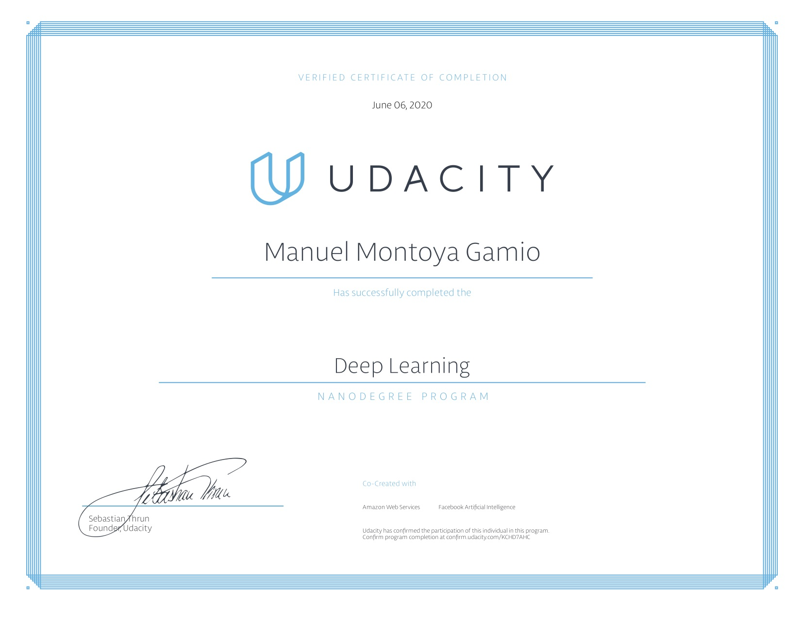

# Udacity Deep Learning Nanodegree

## Project 1: Predicting bike sharing data
Using Pytorch, build and train from scratch a neural network to predict bike sharing data using a given dataset of hourly and daily count of rental bikes.

__Key concepts__: Feedforward, backpropagation, gradient descent, activation functions.

